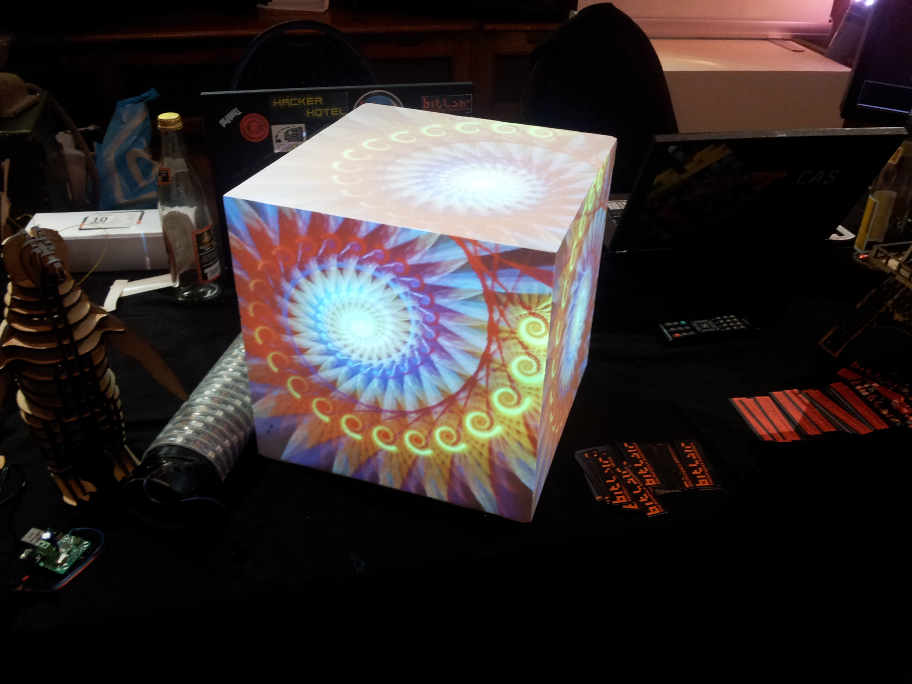

Video Mapper
============

This is a program that can be combined with a beamer to project images and
video onto real-world shapes (currently just cubes).

When started, the configured shape should be adjusted by dragging individual
vertices to match the real-world object.

It's written in C++ and uses OpenGL for rendering and libvlc for media
playback.

This was fun to do. I might continue this project sometime.
